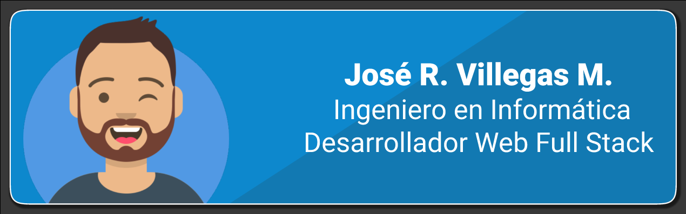

## Hello World 👋🏼 soy Jose!


Soy un Ingeniero en Informática de Venezuela  . Me apasiona hacer código, crear tecnología y trabajar en equipo  Disposición para asumir nuevos desafíos y experiencias profesionales en el área.

## Sobre mi en codigo
```js
const jose = {
  pronouns: "he" | "hinm",
  code: [Javascript, HTML, CSS, SQL, PHP, Python, Java],
  databases: ["MongoDB", "MySQL", "SQLServer"],
  tools: [Git, Node, Docker,"VSCode"],
  architecture: ["microservices", "event-driven", "design system pattern"],
  currentOccupation: "open for job opportunities"

}
```
## Lenguajes y herramientas

<p align="left"> <a href="https://www.gnu.org/software/bash/" target="_blank">  </a> <a href="https://www.w3schools.com/css/" target="_blank">  </a> <a href="https://expressjs.com" target="_blank">  </a> <a href="https://www.figma.com/" target="_blank">  </a> <a href="https://firebase.google.com/" target="_blank">  </a> <a href="https://git-scm.com/" target="_blank">  </a> <a href="https://gulpjs.com" target="_blank">  </a> <a href="https://www.w3.org/html/" target="_blank">  </a> <a href="https://www.java.com" target="_blank">  </a> <a href="https://developer.mozilla.org/en-US/docs/Web/JavaScript" target="_blank">  </a> <a href="https://www.mongodb.com/" target="_blank">  </a> <a href="https://www.mysql.com/" target="_blank">  </a> <a href="https://nodejs.org" target="_blank">  </a> <a href="https://www.oracle.com/" target="_blank">  </a> <a href="https://www.php.net" target="_blank">  </a> <a href="https://postman.com" target="_blank">  </a> <a href="https://www.python.org" target="_blank">  </a> <a href="https://sass-lang.com" target="_blank">  </a> </p>

## 📫 Contactame
<!-- LinkedIn - [José Villegas](https://www.linkedin.com/in/j-villegas/)-->
- 📧 Escríbeme al Email:  **josevmirt@gmail.com**

- <a href="https://linkedin.com/in/j-villegas" target="blank"></a>

⭐ From [JoseVMirt](https://github.com/josevmirt) 

<!--
**josevmirt/josevmirt** is a ✨ _special_ ✨ repository because its `README.md` (this file) appears on your GitHub profile.

Here are some ideas to get you started:

- 🔭 I’m currently working on ...
- 🌱 I’m currently learning ...
- 👯 I’m looking to collaborate on ...
- 🤔 I’m looking for help with ...
- 💬 Ask me about ...
- 📫 How to reach me: ...
- 😄 Pronouns: ...
- ⚡ Fun fact: ...
-->
